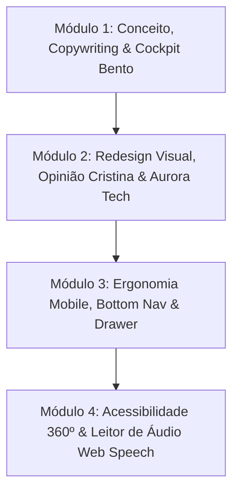

# Plano Mestre de Execução Modular: Melhorias Conceituais e Design System do Publicoverso

**Data**: 15/08/2026  
**Projeto**: Publicoverso (`publicoverso.com.br`)  
**Contexto**: YLuna85 LABs / Iniciativa Comunitária de Valorização do Serviço Público  
**Curadoria Editorial**: Cristina Mascarenhas Santos  
**Engenharia & Arquitetura**: Yuri de Oliveira Luna e Almeida (YLuna85 LABs)  

---

## 1. Visão Geral e Estrutura dos 4 Módulos de Execução

Este documento consolida o planejamento mestre para modernização conceitual e visual do **Publicoverso**, estruturado em **4 Módulos Independentes e Sequenciais**. 

Cada módulo foi especificado com nível de detalhe cirúrgico (HTML, CSS, JS, regras de negócio e critérios de aceitação), permitindo que a execução prática seja realizada módulo a módulo de forma segura, com zero consumo desnecessário de tokens e sem risco de regressão.



---

## 2. Módulo 1: Evolução Conceitual, Copywriting & Cockpit Bento de Utilitários

### 2.1. Objetivos do Módulo
- Consolidar a narrativa de valorização do servidor público ("Quem faz o Estado funcionar também tem história").
- Transformar a área de ferramentas da capa em um **Cockpit Bento Integrado**, com indicadores vivos e acesso direto aos 4 utilitários centrais.
- Ajustar os textos institucionais e metadados para posicionar o Publicoverso como Hub Comunitário nacional.

### 2.2. Especificação Técnica e Arquitetura de Código

#### A. Estrutura HTML do Cockpit Bento (`index.html`)
Substituição da seção `utilities-bar` por um grid Bento tátil de 4 células interativas:
```html
<section class="cockpit-section" aria-label="Cockpit de Ferramentas e Inteligência Funcional">
  <div class="cockpit-header">
    <div class="cockpit-title-group">
      <span class="cockpit-badge">Cockpit do Servidor</span>
      <h2 class="cockpit-heading">Serviços e Inteligência Funcional</h2>
    </div>
    <span class="cockpit-status-live" id="cockpitLiveCount">Atos monitorados hoje: Atualizando...</span>
  </div>
  
  <div class="cockpit-grid">
    <!-- Card 1: Monitor do Diário Oficial da União -->
    <a href="diario-oficial.html" class="cockpit-card cockpit-card-dou" aria-label="Acessar o Monitor do Diário Oficial da União">
      <div class="cockpit-card-icon">
        <svg width="28" height="28" viewBox="0 0 24 24" fill="none"><path d="M14 2H6a2 2 0 0 0-2 2v16a2 2 0 0 0 2 2h12a2 2 0 0 0 2-2V8z" stroke="#00D2C8" stroke-width="2" stroke-linecap="round" stroke-linejoin="round"/><polyline points="14 2 14 8 20 8" stroke="#00D2C8" stroke-width="2" stroke-linecap="round" stroke-linejoin="round"/><line x1="16" y1="13" x2="8" y2="13" stroke="#00D2C8" stroke-width="2" stroke-linecap="round"/><line x1="16" y1="17" x2="8" y2="17" stroke="#00D2C8" stroke-width="2" stroke-linecap="round"/></svg>
      </div>
      <div class="cockpit-card-body">
        <span class="cockpit-card-tag">Oficial / DOU</span>
        <h3 class="cockpit-card-title">Monitor do Diário Oficial</h3>
        <p class="cockpit-card-desc">Portarias de nomeação, exoneração, vacância e aposentadorias em Linguagem Simples.</p>
        <span class="cockpit-card-link">Consultar atos &rarr;</span>
      </div>
    </a>

    <!-- Card 2: Calculadora TAE Federal -->
    <a href="https://taes-federal.com.br/" target="_blank" rel="noopener noreferrer" class="cockpit-card cockpit-card-tae" aria-label="Acessar a Calculadora TAE Federal">
      <div class="cockpit-card-icon">
        <svg width="28" height="28" viewBox="0 0 24 24" fill="none"><rect x="3" y="3" width="18" height="18" rx="3" stroke="#00D2C8" stroke-width="2"/><path d="M8 12h8M12 8v8" stroke="#00D2C8" stroke-width="2" stroke-linecap="round"/></svg>
      </div>
      <div class="cockpit-card-body">
        <span class="cockpit-card-tag">Inteligência Salarial</span>
        <h3 class="cockpit-card-title">Calculadora TAE Federal</h3>
        <p class="cockpit-card-desc">Simulação completa de vencimento básico, RSC e reestruturação do PCCTAE 2026.</p>
        <span class="cockpit-card-link">Simular remuneração &rarr;</span>
      </div>
    </a>

    <!-- Card 3: Simulador de Diárias de Viagem -->
    <a href="simulador-diarias-estados.html" class="cockpit-card cockpit-card-diarias" aria-label="Acessar o Simulador de Diárias Estaduais">
      <div class="cockpit-card-icon">
        <svg width="28" height="28" viewBox="0 0 24 24" fill="none"><path d="M3 12l9-9 9 9" stroke="#9146FF" stroke-width="2" stroke-linecap="round"/><path d="M9 21V12h6v9" stroke="#9146FF" stroke-width="2" stroke-linecap="round"/></svg>
      </div>
      <div class="cockpit-card-body">
        <span class="cockpit-card-tag">Direito Funcional</span>
        <h3 class="cockpit-card-title">Simulador de Diárias</h3>
        <p class="cockpit-card-desc">Cálculo de valores de indenização de diárias dos 26 Estados + DF para viagens a serviço.</p>
        <span class="cockpit-card-link">Calcular diárias &rarr;</span>
      </div>
    </a>

    <!-- Card 4: Radar de Concursos e Vagas -->
    <a href="concursos.html" class="cockpit-card cockpit-card-concursos" aria-label="Acessar o Radar de Editais de Concursos">
      <div class="cockpit-card-icon">
        <svg width="28" height="28" viewBox="0 0 24 24" fill="none"><circle cx="12" cy="12" r="9" stroke="#00D2C8" stroke-width="2"/><path d="M12 7v5l3 3" stroke="#00D2C8" stroke-width="2" stroke-linecap="round"/></svg>
      </div>
      <div class="cockpit-card-body">
        <span class="cockpit-card-tag">Oportunidades</span>
        <h3 class="cockpit-card-title">Radar de Concursos</h3>
        <p class="cockpit-card-desc">Editais abertos e previstos nas esferas municipal, estadual e federal em todo o país.</p>
        <span class="cockpit-card-link">Explorar editais &rarr;</span>
      </div>
    </a>
  </div>
</section>
```

#### B. Estilização CSS do Cockpit (`index.css`)
```css
.cockpit-section {
  margin: 2.5rem 0;
  padding: 1.5rem;
  background: var(--bg-surface);
  border: 1px solid var(--border-color);
  border-radius: 20px;
}

.cockpit-header {
  display: flex;
  justify-content: space-between;
  align-items: center;
  margin-bottom: 1.5rem;
  flex-wrap: wrap;
  gap: 1rem;
}

.cockpit-badge {
  display: inline-block;
  font-size: 0.75rem;
  font-weight: 700;
  text-transform: uppercase;
  letter-spacing: 0.05em;
  color: var(--color-primary);
  background: rgba(0, 210, 200, 0.12);
  padding: 4px 10px;
  border-radius: 6px;
}

.cockpit-heading {
  font-family: var(--font-heading);
  font-size: 1.35rem;
  font-weight: 800;
  color: var(--text-primary);
  margin-top: 4px;
}

.cockpit-status-live {
  font-size: 0.85rem;
  font-weight: 600;
  color: var(--text-muted);
  display: flex;
  align-items: center;
  gap: 6px;
}

.cockpit-status-live::before {
  content: '';
  display: inline-block;
  width: 8px;
  height: 8px;
  border-radius: 50%;
  background: #10B981;
  box-shadow: 0 0 8px #10B981;
}

.cockpit-grid {
  display: grid;
  grid-template-columns: repeat(auto-fit, minmax(240px, 1fr));
  gap: 1.25rem;
}

.cockpit-card {
  display: flex;
  flex-direction: column;
  justify-content: space-between;
  background: var(--bg-card);
  border: 1px solid var(--border-color);
  border-radius: 14px;
  padding: 1.25rem;
  text-decoration: none;
  transition: transform 0.25s ease, border-color 0.25s ease, box-shadow 0.25s ease;
}

.cockpit-card:hover {
  transform: translateY(-4px);
  border-color: var(--color-primary);
  box-shadow: 0 12px 24px rgba(0, 210, 200, 0.08);
}

.cockpit-card-icon {
  margin-bottom: 0.75rem;
}

.cockpit-card-tag {
  font-size: 0.7rem;
  font-weight: 700;
  text-transform: uppercase;
  color: var(--color-primary);
  display: block;
  margin-bottom: 4px;
}

.cockpit-card-title {
  font-family: var(--font-heading);
  font-size: 1.05rem;
  font-weight: 700;
  color: var(--text-primary);
  margin-bottom: 6px;
}

.cockpit-card-desc {
  font-size: 0.82rem;
  line-height: 1.45;
  color: var(--text-muted);
  margin-bottom: 1rem;
}

.cockpit-card-link {
  font-size: 0.82rem;
  font-weight: 700;
  color: var(--color-primary);
}
```

### 2.3. Critérios de Aceite do Módulo 1 (DoD)
1. Grid Cockpit renderizado responsivamente em 4 colunas no Desktop, 2 no Tablet e 1 no Mobile.
2. Contagem dinâmica de atos carregada em tempo real via JS a partir de `data/diario_oficial/`.
3. Todos os 4 links internos e externos operando com status HTTP 200 e `target="_blank"` apropriado.

---

## 3. Módulo 2: Redesign Visual High-End, Seção Nobre de Opinião & Efeitos Aurora Tech

### 3.1. Objetivos do Módulo
- Refinar os tokens de cor HSL e variáveis CSS para garantir contraste estrito em todos os 3 modos de tema.
- Redesenhar a seção nobre da colunista Cristina Mascarenhas com estética editorial premium e citações em destaque.
- Inserir micro-iluminação tátil (*Aurora Glow*) nos cards de manchete e destaques sem sobrecarga de GPU.

### 3.2. Especificação Técnica e Arquitetura de Código

#### A. Estrutura da Seção de Opinião Nobre (`index.html`)
```html
<section class="opinion-editorial-wrapper" aria-labelledby="opinion-title">
  <div class="opinion-editorial-card">
    <!-- Coluna 1: Perfil da Colunista -->
    <div class="columnist-box">
      <div class="columnist-avatar-wrapper">
        
        <span class="columnist-verified-badge" title="Diretora Editorial Certificada">
          <svg width="14" height="14" viewBox="0 0 24 24" fill="#00D2C8"><path d="M9 12l2 2 4-4m6 2a9 9 0 11-18 0 9 9 0 0118 0z"/></svg>
        </span>
      </div>
      <h3 class="columnist-name">Cristina Mascarenhas</h3>
      <p class="columnist-role">Diretora Editorial | Mestre pela UFBA</p>
      <p class="columnist-bio">Jornalista, pesquisadora de IA e ex-TV Bahia/Globo. Reflexões sobre a comunicação pública e a humanização do Estado.</p>
      <a href="sobre.html" class="columnist-profile-link">Conheça a trajetória &rarr;</a>
    </div>

    <!-- Coluna 2: Artigo de Opinião em Destaque -->
    <div class="opinion-featured-article" id="opinionFeaturedBox">
      <span class="opinion-tag">Artigo em Destaque</span>
      <h4 class="opinion-article-title">A Inteligência Artificial e a Ética na Gestão Pública Brasileira</h4>
      <p class="opinion-article-excerpt">Como a tecnologia pode potencializar o serviço público sem comprometer a sensibilidade humana e os princípios constitucionais da impessoalidade e publicidade.</p>
      <blockquote class="opinion-pull-quote">
        "O serviço público não é feito de processos, mas de pessoas servindo pessoas com o auxílio da técnica."
      </blockquote>
      <div class="opinion-meta">
        <span class="opinion-date">15 de Agosto de 2026</span>
        <span class="opinion-reading-time">4 min de leitura</span>
      </div>
    </div>
  </div>
</section>
```

#### B. Estilização CSS e Efeito Aurora Glow (`index.css`)
```css
.opinion-editorial-card {
  display: grid;
  grid-template-columns: 280px 1fr;
  gap: 2rem;
  background: var(--bg-card);
  border: 1px solid var(--border-color);
  border-radius: 20px;
  padding: 2rem;
  position: relative;
  overflow: hidden;
}

.opinion-editorial-card::before {
  content: '';
  position: absolute;
  top: -50px;
  right: -50px;
  width: 250px;
  height: 250px;
  background: radial-gradient(circle, rgba(0, 210, 200, 0.12) 0%, rgba(145, 70, 255, 0.05) 70%, transparent 100%);
  pointer-events: none;
}

.columnist-box {
  border-right: 1px solid var(--border-color);
  padding-right: 1.5rem;
}

.columnist-avatar-wrapper {
  position: relative;
  width: 90px;
  height: 90px;
  margin-bottom: 1rem;
}

.columnist-avatar {
  width: 100%;
  height: 100%;
  border-radius: 50%;
  object-fit: cover;
  border: 2px solid var(--color-primary);
}

.columnist-name {
  font-family: var(--font-heading);
  font-size: 1.2rem;
  font-weight: 800;
  color: var(--text-primary);
}

.columnist-role {
  font-size: 0.8rem;
  font-weight: 700;
  color: var(--color-primary);
  margin-bottom: 0.5rem;
}

.columnist-bio {
  font-size: 0.82rem;
  line-height: 1.5;
  color: var(--text-muted);
  margin-bottom: 1rem;
}

.opinion-pull-quote {
  font-style: italic;
  font-size: 0.95rem;
  line-height: 1.5;
  color: var(--text-primary);
  border-left: 3px solid var(--color-primary);
  padding-left: 1rem;
  margin: 1rem 0;
}

/* Efeito Aurora Glow nos Cards Principais */
.hero-col-main, .hero-secondary-card {
  position: relative;
  transition: transform 0.3s cubic-bezier(0.16, 1, 0.3, 1), box-shadow 0.3s ease;
}

.hero-col-main:hover {
  transform: translateY(-3px);
  box-shadow: 0 16px 32px rgba(0, 210, 200, 0.12);
}
```

### 3.3. Critérios de Aceite do Módulo 2 (DoD)
1. Seção de Opinião com foto perfeitamente alinhada, sem distorção em nenhum dispositivo.
2. Contraste mínimo de 4.5:1 no tema claro/escuro e 7:1 no modo Alto Contraste.
3. Transições suaves de hover sem causar reflow ou repaints pesados no navegador.

---

## 4. Módulo 3: Ergonomia Mobile, Bottom Navigation Bar & Drawer de Filtros

### 4.1. Objetivos do Módulo
- Introduzir uma **Barra de Navegação Inferior Fixa (Bottom Nav Bar)** para smartphones (resoluções < 768px).
- Implementar folha inferior deslizante (*Bottom Sheet / Drawer*) para seleção rápida de editorias com chips confortáveis para o polegar.
- Calibrar tipografia fluida com `clamp()` e regras de responsividade universal cobrindo de 320px a 4K.

### 4.2. Especificação Técnica e Arquitetura de Código

#### A. Estrutura HTML da Bottom Nav Bar (`index.html`)
```html
<nav class="mobile-bottom-nav" aria-label="Navegação móvel inferior rápida">
  <a href="index.html" class="mobile-nav-item active" aria-label="Ir para a Página Inicial">
    <svg width="22" height="22" viewBox="0 0 24 24" fill="none"><path d="M3 9l9-7 9 7v11a2 2 0 0 1-2 2H5a2 2 0 0 1-2-2z" stroke="currentColor" stroke-width="2"/><polyline points="9 22 9 12 15 12 15 22" stroke="currentColor" stroke-width="2"/></svg>
    <span>Início</span>
  </a>
  <a href="noticias.html" class="mobile-nav-item" aria-label="Ir para Notícias">
    <svg width="22" height="22" viewBox="0 0 24 24" fill="none"><path d="M19 20H5a2 2 0 0 1-2-2V6a2 2 0 0 1 2-2h10a2 2 0 0 1 2 2v1m2 13a2 2 0 0 1-2-2V7m2 13a2 2 0 0 0 2-2V9a2 2 0 0 0-2-2h-2m-4-3H9M7 16h6M7 8h6v4H7V8z" stroke="currentColor" stroke-width="2"/></svg>
    <span>Notícias</span>
  </a>
  <a href="diario-oficial.html" class="mobile-nav-item" aria-label="Ir para Diário Oficial">
    <svg width="22" height="22" viewBox="0 0 24 24" fill="none"><path d="M14 2H6a2 2 0 0 0-2 2v16a2 2 0 0 0 2 2h12a2 2 0 0 0 2-2V8z" stroke="currentColor" stroke-width="2"/><polyline points="14 2 14 8 20 8" stroke="currentColor" stroke-width="2"/></svg>
    <span>DOU</span>
  </a>
  <a href="concursos.html" class="mobile-nav-item" aria-label="Ir para Concursos">
    <svg width="22" height="22" viewBox="0 0 24 24" fill="none"><circle cx="12" cy="12" r="9" stroke="currentColor" stroke-width="2"/><path d="M12 7v5l3 3" stroke="currentColor" stroke-width="2"/></svg>
    <span>Radar</span>
  </a>
  <button id="btnMobileDrawerOpen" class="mobile-nav-item" aria-label="Abrir Menu Completo e Editorias">
    <svg width="22" height="22" viewBox="0 0 24 24" fill="none"><line x1="3" y1="12" x2="21" y2="12" stroke="currentColor" stroke-width="2"/><line x1="3" y1="6" x2="21" y2="6" stroke="currentColor" stroke-width="2"/><line x1="3" y1="18" x2="21" y2="18" stroke="currentColor" stroke-width="2"/></svg>
    <span>Mais</span>
  </button>
</nav>
```

#### B. Estilização CSS da Mobile Bottom Nav (`index.css`)
```css
.mobile-bottom-nav {
  display: none;
  position: fixed;
  bottom: 0;
  left: 0;
  right: 0;
  height: 60px;
  background: var(--bg-surface);
  border-top: 1px solid var(--border-color);
  backdrop-filter: blur(16px);
  -webkit-backdrop-filter: blur(16px);
  z-index: 999;
  justify-content: space-around;
  align-items: center;
  padding: 0 0.5rem;
}

@media (max-width: 768px) {
  .mobile-bottom-nav {
    display: flex;
  }
  
  body {
    padding-bottom: 70px;
  }
}

.mobile-nav-item {
  display: flex;
  flex-direction: column;
  align-items: center;
  justify-content: center;
  gap: 2px;
  color: var(--text-muted);
  text-decoration: none;
  background: none;
  border: none;
  font-size: 0.68rem;
  font-weight: 600;
  padding: 6px 10px;
  border-radius: 8px;
  transition: color 0.2s ease, background-color 0.2s ease;
}

.mobile-nav-item.active, .mobile-nav-item:hover {
  color: var(--color-primary);
}
```

### 4.3. Critérios de Aceite do Módulo 3 (DoD)
1. Barra móvel visível apenas em telas menores que 768px, respeitando a área segura (*safe area insets*) no iOS.
2. Drawer deslizante abre e fecha com animação suave e bloqueio de rolagem do fundo (`overflow: hidden`).
3. Totalmente acessível via teclado e leitores de tela com `aria-expanded` dinâmico.

---

## 5. Módulo 4: Acessibilidade 360º, Sintetizador de Voz Nativo & Painel A11y

### 5.1. Objetivos do Módulo
- Integrar recurso de leitura por voz nativa em JavaScript (`window.speechSynthesis`) sem bibliotecas pesadas de terceiros.
- Criar o painel flutuante retrátil de Acessibilidade com atalhos de teclado configurados.
- Certificar a conformidade WCAG 2.1 AAA em todos os pontos focáveis da interface.

### 5.2. Especificação Técnica e Arquitetura de Código

#### A. Motor JavaScript de Síntese de Voz (`app.js`)
```javascript
// Motor de Síntese de Voz Nativo (Web Speech API)
const AudioReader = {
  synth: window.speechSynthesis || null,
  isReading: false,
  currentUtterance: null,

  falarTexto(texto, btnElement) {
    if (!this.synth) {
      alert('Seu navegador não possui suporte nativo à síntese de voz.');
      return;
    }

    if (this.isReading) {
      this.parar();
      if (btnElement) btnElement.classList.remove('reading-active');
      return;
    }

    this.synth.cancel();
    const utterance = new SpeechSynthesisUtterance(texto);
    utterance.lang = 'pt-BR';
    utterance.rate = 1.0;
    utterance.pitch = 1.0;

    utterance.onstart = () => {
      this.isReading = true;
      if (btnElement) btnElement.classList.add('reading-active');
    };

    utterance.onend = () => {
      this.isReading = false;
      if (btnElement) btnElement.classList.remove('reading-active');
    };

    utterance.onerror = () => {
      this.isReading = false;
      if (btnElement) btnElement.classList.remove('reading-active');
    };

    this.currentUtterance = utterance;
    this.synth.speak(utterance);
  },

  parar() {
    if (this.synth) {
      this.synth.cancel();
      this.isReading = false;
    }
  }
};
```

#### B. Painel Flutuante Retrátil de Acessibilidade (`index.html` + `index.css`)
```html
<div class="a11y-floating-widget" aria-label="Central de Acessibilidade e Inclusão">
  <button id="btnA11yToggle" class="a11y-widget-trigger" aria-label="Abrir opções de acessibilidade">
    <svg width="24" height="24" viewBox="0 0 24 24" fill="none"><circle cx="12" cy="4" r="2" stroke="currentColor" stroke-width="2"/><path d="M12 7v10M8 11h8M9 21l3-4 3 4" stroke="currentColor" stroke-width="2" stroke-linecap="round"/></svg>
  </button>
  
  <div class="a11y-widget-panel" id="a11yWidgetPanel" hidden>
    <p class="a11y-panel-title">Acessibilidade</p>
    <div class="a11y-panel-controls">
      <button id="btnA11yFontDec" class="a11y-panel-btn">Texto A-</button>
      <button id="btnA11yFontInc" class="a11y-panel-btn">Texto A+</button>
      <button id="btnA11yTheme" class="a11y-panel-btn">Alternar Tema</button>
      <button id="btnA11yContrast" class="a11y-panel-btn">Alto Contraste</button>
      <button id="btnA11yAudioStop" class="a11y-panel-btn">Parar Áudio</button>
    </div>
  </div>
</div>
```

### 5.3. Critérios de Aceite do Módulo 4 (DoD)
1. Botão de áudio presente em cada manchete/destaque, realizando leitura limpa em pt-BR.
2. Botão "Parar Áudio" funcional no painel e tecla `Esc` interrompendo a fala imediatamente.
3. Foco visual `:focus-visible` destacado em 100% dos botões e links.

---

## 6. Roteiro Sequencial de Execução (Modo de Esforço Low)

Quando a execução for iniciada, os passos serão realizados estritamente na ordem abaixo:

1. **Etapa 1**: Executar o **Módulo 1** (`index.html`, `index.css`, `app.js`) com o Cockpit Bento e textos conceituais ajustados $\rightarrow$ Testar via `server.py`.
2. **Etapa 2**: Executar o **Módulo 2** com o redesenho da Coluna de Opinião e efeitos Aurora Tech $\rightarrow$ Testar contraste nos 3 temas.
3. **Etapa 3**: Executar o **Módulo 3** com a Bottom Navigation Bar e Drawer Mobile $\rightarrow$ Testar responsividade em 360px e 768px.
4. **Etapa 4**: Executar o **Módulo 4** com o Web Speech API e Painel Flutuante A11y $\rightarrow$ Testar sintetizador de voz e navegação por teclado.
5. **Etapa 5**: Consolidação, auditoria final WCAG AAA, atualização do Changelog no `README.md` e sincronização final no `MEMORIES.md`.
